# Obsidian使用教程

## 1.资料库

### 1.1点击创建一个新的库

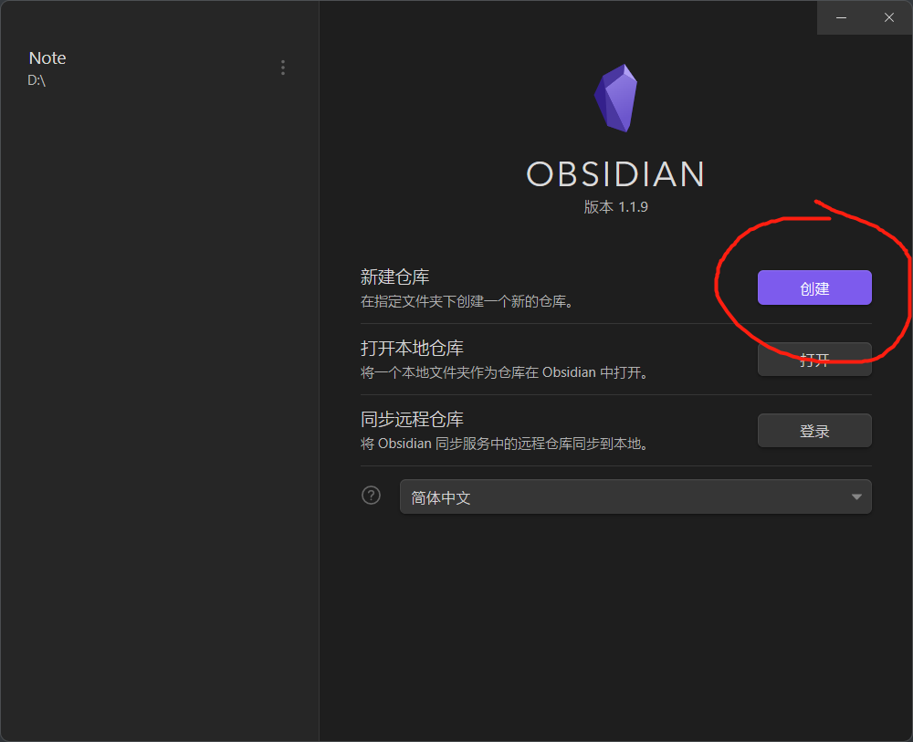

### 2.2给库指定一个文件夹作为资料库

> **Obsidian所有的资料都是基于资料库的，在Obsidian中所创建的每一条内容，它都是隶属于一个资料库的**
>
> 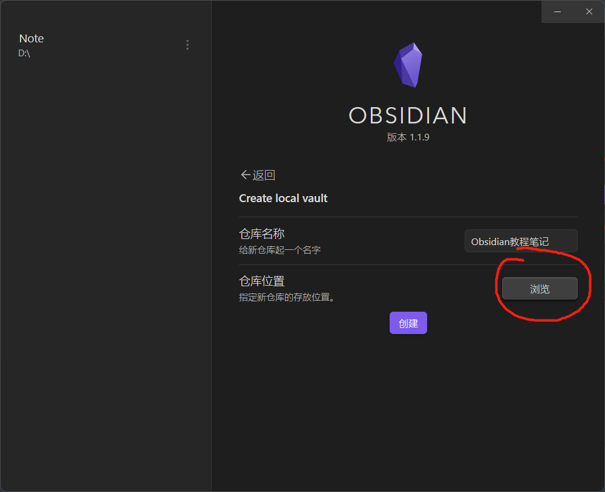

### 1.3  Obsidian文件记录

关于Obsidian的所有设置都会在.obsidian文件夹中记录

* 设置快捷键会保存在hotkeys.json文件中

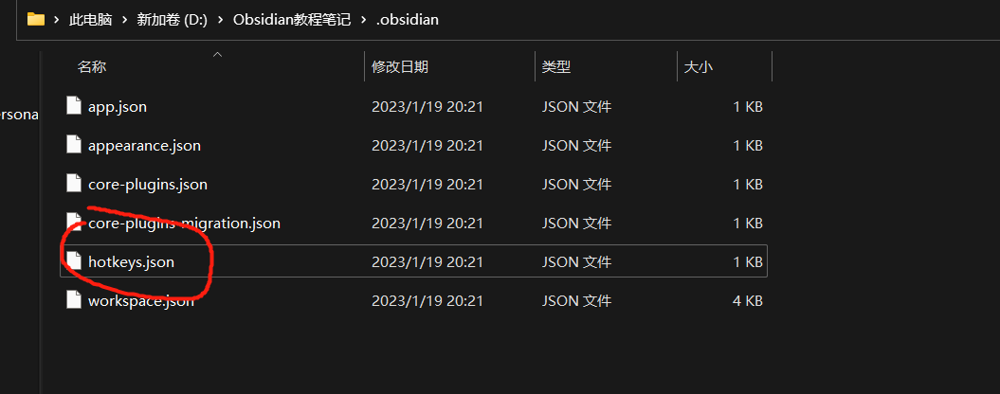

* Obsidian插件会安装在plugins文件夹中
* Obsidian主题会安装在themes文件夹中

**==注意==** **：在Obsidian中所有内容都是隶属于一个资料库的，所以当切换了一个资料库的时候。会发现在另一个资料库设置的主题插件等内容全部都没有了，解决方法就是原资料库的.obsidian文件夹复制到新资料库的文件夹中就可以了**

## 2.界面

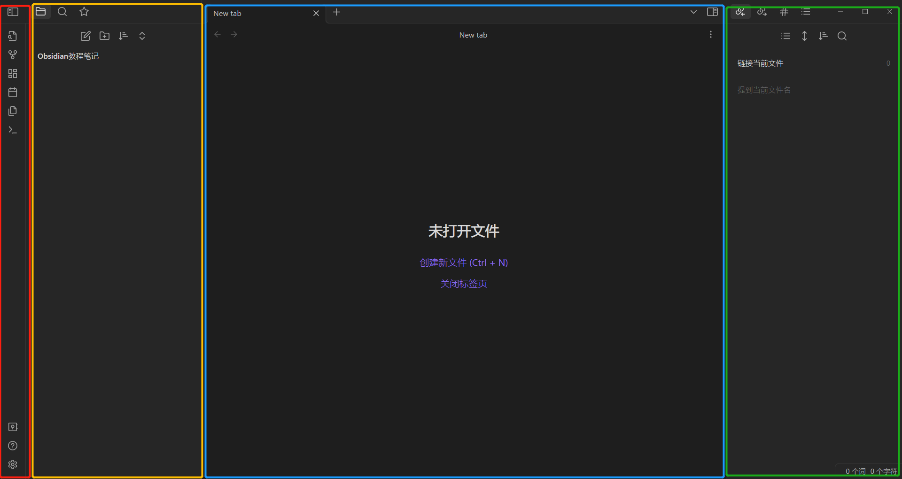

### **2.1**<font color='RedOrange'>**功能区域**</font>

#### **2.1.1 快速切换按钮**

> **点击快速切换按钮，可以直接在搜素栏输入搜索一些文章的标题。之后会列出相关的文章，通过上下键/鼠标滚轮选择，按回车键打开需要的文章**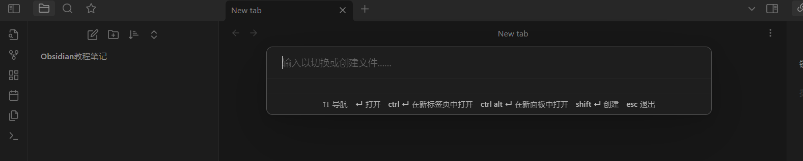

#### **2.1.2 关系图谱按钮**

>  **后续随着笔记越来越多 ，可以在这里看见笔记与笔记之间的知识链接关系**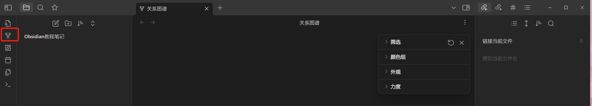

#### **2.1.3 命令面板按钮**

> 快速让Obsidian执行一些快捷命令（建议用英文版）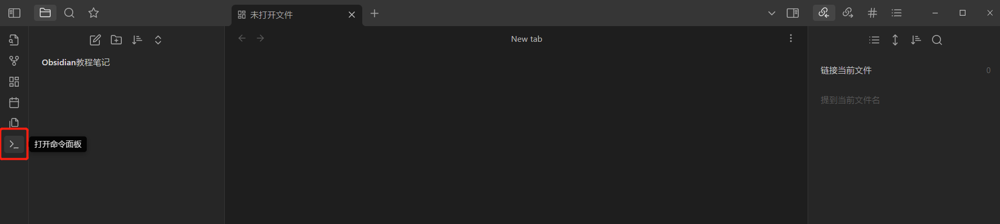
>
> 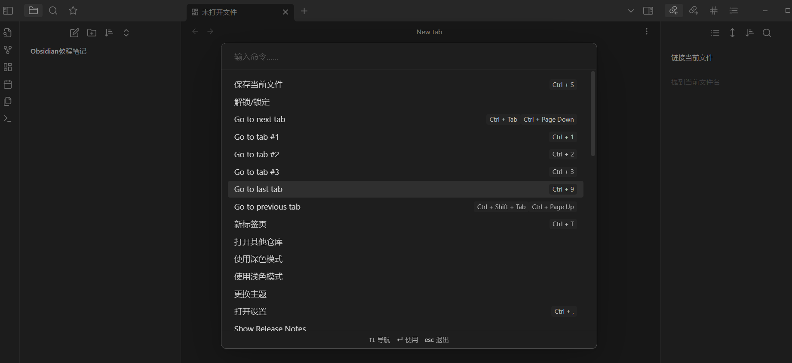

#### **2.1.4 设置按钮**

> **快捷键是Ctrl + ，**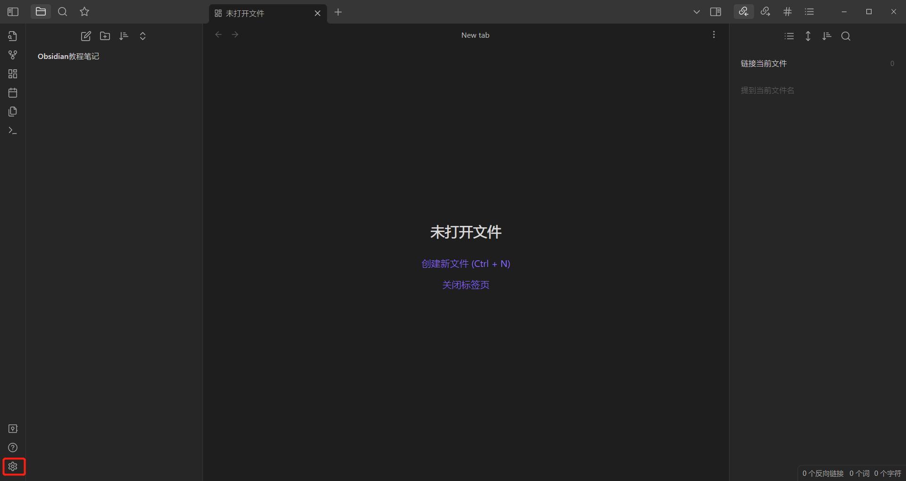
>
> 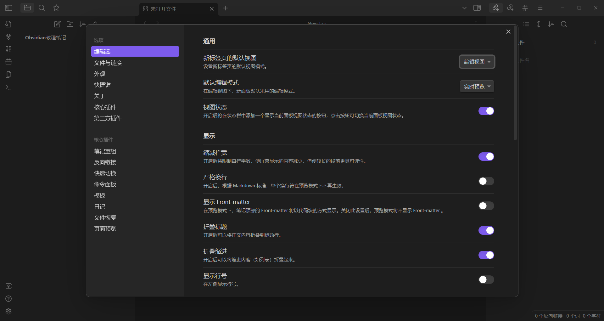


### **2.2**<font color='orange'>**笔记列表区域**</font>

#### **2.2.1 文件选项**

> <font color='RedOrange'>**新建笔记**</font>
>
> <font color='orange'>**新建文件夹**</font>
>
> <font color='Blue'>**笔记文件排序**</font>
>
> <font color='Rhodamine '>**展开所有笔记文件夹与笔记**</font>
>
> 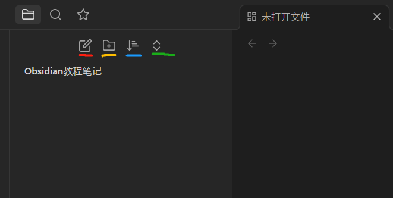

#### **2.2.2 搜索选项**

> **在搜索栏中使用一些通配符来搜索已有的一些文件（Sandox插件可以看见笔记的数量）**
>
> 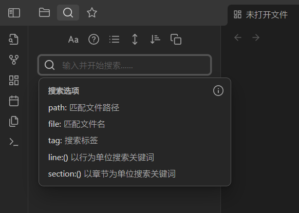

### **2.3**<font color='Blue'>**笔记展示区域**</font>

> **创建笔记，使用Mardown语法码字**
>
> ==**注意**== **：如果要对Obsidian当中的资料笔记进行修改的话，最好是在Obsidian这个工具中去进行修改。资源管理器中修改，Obsidian会识别不到里面的链接内容**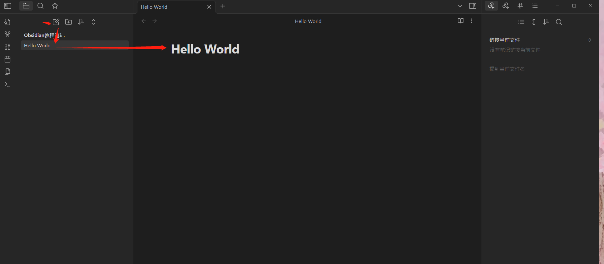

#### **2.3.1 笔记附件归类**

**1.在文件选项按钮中创建Inbox/attchment文件夹**

**2.Ctrl + ，快捷键 设置新建笔记的存放位置，选择指定的附件文件夹选项并且在下方选择Inbox文件夹**

**3.这样新建的笔记文件无论多少都会出现在Inbox文件夹中**

**4.笔记附件的图片文件夹attchment也是按照如上操作**

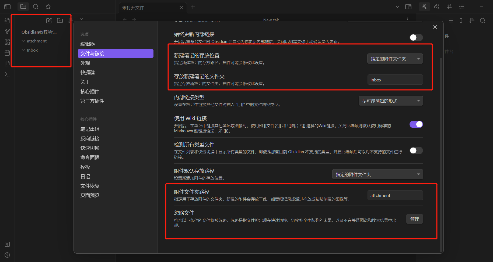

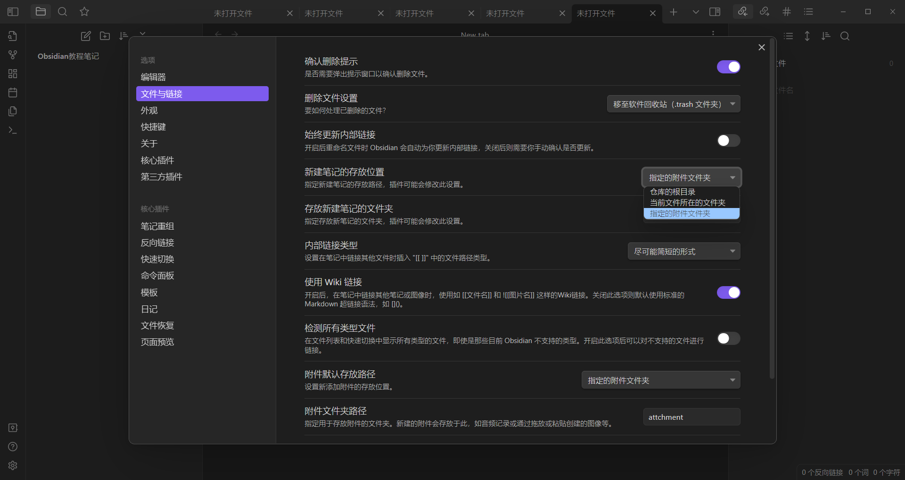

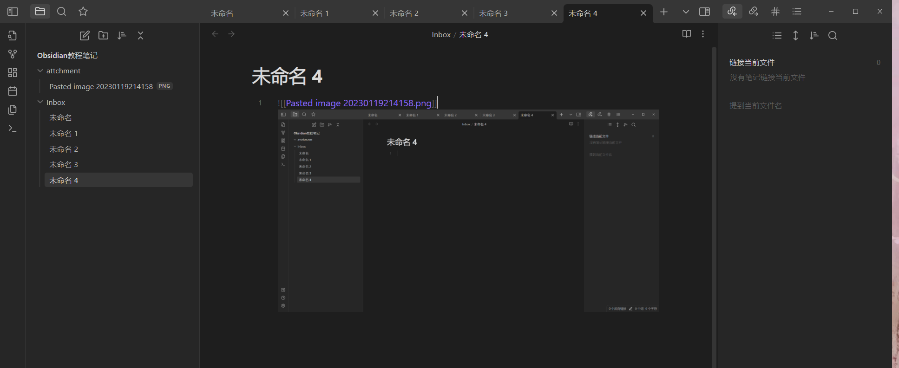

## 3.双链

### 3.1 什么是双链？

先科普一下：链接

* 入链（反向链接）
* 出链

### 3.2 如何运用双链？

#### 3.2.1 创建链接

##### 链接到文章

```java
链接到文章：[[1.Obsidian简介]]
```

##### 链接到某个标题

```java
链接到某个标题：[[1.Obsidian简介#3 Obsidian定位]]
```

##### 链接到文本块

```java
链接到文本块:[[1.Obsidian简介#^e3f585]]
```

##### 链接别名

```java
链接别名:[[1.Obsidian简介#^e3f585 | Obsidian中文名]]
```

#### 3.2.2 查看链接

* **查看链接内容**
  * 核心插件 =>  页面预览
  * 按住Ctrl 预览
  * 现实内容！
* 打开链接面板

#### 3.3 Ob带来的新思维

> **基于方法使用工具， 基于思维提炼方法。**

* 链接 -> 关联思维
  * 这意味着 
    * 花更多功夫整理有价值的笔记 
    * 这解释了 Obsidian是什么？

* 片段 -> 整合思维 
  * 这意味着 
    * 多整理有价值的片段 
    * 片段成文